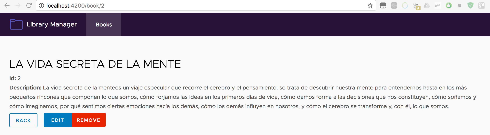

# angular-training
Collection of Angular 4 examples

## Description

* **Dynamic Library Management (ClarityUI):** The full implementation of the training. Needs to be launched alongside a Node Backend from this repo (BackendDB or BackendMEM). It's the frontend part.
* **Node Example Array:** Very basic nodeJS example which removes zeroes and order a bidimensional matrix.
* **Node Example Array Lodash:** Variant from previous project, it uses lodash npm package in order to illustrate node packages usage with require statement.
* **Node Example Array Module:** Another variant from the 2 past projects. Illustrate the architecture in nodeJS where the methods which order and remove zeroes are located in an external module.
* **Node Library Management Backend (DB):** nodeJS implementation of a Backend that stores the data in a neDB database (using npm package).
* **Node Library Management Backend (MEM):** Variant from the previous node backend which just use in memory storage and handle all the request manually. It's more illustrative and solve various problems appeared during manual implementation like enabling CORS or more HTTP2 methods.
* **Static Library Management (ClarityUI):** A previous implementation of the Library Management frontend, it does not need a backend due to the storage are handled in memory by an Angular Service.
* **Static Library Management (noUI):** First implementation of the previous explained project.

## Fully functional example deployment

* **Backend:** go to desired backend directory and run: `npm install && node bin/www``. It will listen in http://localhost:3000/books
* **Frontend:** Prebuilt version is available in /dist folder (only in Dynamic project). You can deploy it using any static content web serever (Apache, NginX…). The easiest way is using *http-serve* npm module with `http-serve .` launching it within /dist folder. **The backend must be listening in `http://localhost:3000/books`**. 

### Detailed info about the projects can be found inside its folders.

Some ideas and code taken from @codeurjc and @micaelgallego from his course @ Universidad Rey Juan Carlos, Madrid, Spain in April 2017

